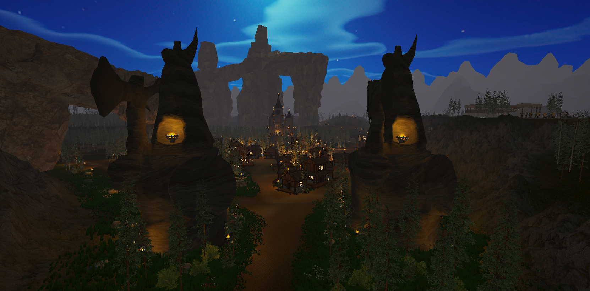

# 🐉 Eteria World

> **RPG de mundo abierto** desarrollado completamente de forma independiente por un estudiante de colegio, desde el primer triángulo hasta los sistemas de combate, shaders y cinemáticas.

<p align="center">
  <!-- Reemplaza esta línea con un GIF o screenshot del juego -->
  
</p>

<p align="center">
  
  
  
  
  
</p>

---

## ¿Qué es Eteria World?

Eteria World es un RPG 3D de mundo abierto con sistema de captura y doma de dragones, combate elemental por turnos, crafting, cinemáticas narrativas y un mundo de **5 islas con biomas únicos**. Cada sistema del juego —desde los shaders hasta la IA de los NPCs— fue diseñado, implementado y optimizado de forma completamente autodidacta.

El proyecto nació como un experimento de aprendizaje y creció hasta convertirse en un juego con **más de 28.000 líneas de código**, más de **100 modelos 3D con texturas pintadas a mano** y un pipeline técnico comparable al de proyectos de estudio indie.

---

## Métricas del proyecto

| Área | Detalle |
|------|---------|
| 🗺️ Mundo | 5 islas · 20 cuadrículas · múltiples biomas |
| 💻 Código | +28.000 líneas · +30 scripts · +15 documentos UI |
| 🎨 Arte 3D | +100 modelos · texturas pintadas a mano en Krita |
| ⚡ Shaders | ~10 shaders propios · ~10 grafos VFX |
| 🚀 Rendimiento | 30 FPS estables en gama baja · de 5.000 → 2.000 draw calls |
| 🐉 Dragones | 8–10 especies · rigging con 100+ huesos · variación por instancia |
| 🏅 Reconocimiento | Medalla de Oro Nacional Infomatrix · Representación en México 2026 |

---

## Sistemas principales

### 🐉 Sistema de Dragones
Cada dragón se genera con textura base y variación de color por instancia, se guarda en base de datos, puede ser capturado, domado y montado. El rigging usa más de 100 huesos con weight painting manual para deformaciones naturales. Las animaciones (idle, caminar, volar, montar, atacar) se gestionan mediante un Avatar compartido en Unity que permite reutilizar clips entre todos los modelos.

```
Blender (blocking → rigging → weight painting)
    → exportación con armature base unificada
        → Unity Animator con máquina de estados
            → controlador de vuelo con detección de altura en tiempo real
```

<p align="center">
  <!-- Inserta aquí screenshot o GIF del sistema de vuelo -->
  
</p>

---

### ⚔️ Sistema de Combate
Combate por turnos entre dragones con cuatro ataques vinculados al tipo elemental (fuego, tierra, etc.). El combate del personaje soporta combos encadenados que se activan dentro de ventanas de tiempo sin cortar la animación. Los efectos visuales de impacto se construyen con grafos VFX usando física de partículas y texturas animadas con emisión.

```
Combo input → ventana de tiempo activa → transición sin corte → siguiente animación
Tipo de dragón → ataque elemental → grafo VFX específico → daño al sistema de vida (Canvas)
```

---

### 🎨 Pipeline de Arte
Todo el arte del juego —modelos, texturas, shaders y VFX— fue creado sin assets de terceros pagos. El flujo de trabajo va de Blender para modelado y rigging, Krita para texturas pintadas a mano, y Unity Shader Graph para efectos en tiempo real.

<p align="center">
  <!-- Inserta aquí un render de modelo o comparación antes/después -->
  
</p>

---

### ⚙️ Optimización de Rendimiento
La optimización fue tratada como un sistema central del proyecto, no como un paso final. Se aplicaron técnicas avanzadas a nivel de GPU, lógica y escena:

- **Draw calls**: reducción de 5.000 a 2.000 mediante combinación de mallas y GPU instancing en materiales
- **LOD**: aplicado en todos los modelos 3D y también en la lógica de NPCs (radio de activación de IA)
- **Occlusion Culling**: configurado por zonas para evitar renderizar geometría fuera del frustum
- **Bake de iluminación**: luces estáticas precalculadas para eliminar costo de renderizado en tiempo real
- **Shader reactivo multi-textura**: un solo material por objeto con blend de texturas configurable desde parámetros, eliminando variantes de material innecesarias
- **Árboles via GPU**: instanciados directamente desde datos procesados en GPU, sin GameObjects
- **Análisis por frame**: uso del Frame Debugger y Profiler de Unity para identificar cuellos de botella por hilo de renderizado

> *Resultado: 30 FPS estables en hardware gama media-baja con gráficos en calidad media, 40 FPS en calidad baja.*

---

### 🌊 Shaders Propios

| Shader | Descripción |
|--------|-------------|
| Agua con olas | Normal maps animados con nodo de tiempo, efecto de profundidad por distancia al fondo |
| Cascadas | Movimiento de flujo con distorsión UV y emisión |
| Césped reactivo | Movimiento de viento, colisión con el jugador, sin impacto en FPS |
| Shader reactivo | Blend de múltiples texturas con control de opacidad y canal alfa, usado en terreno y modelos |
| Dragones | Variación de color por instancia sobre textura base, sin duplicar material |
| Terreno | Pintado manual con brocha, múltiples capas de textura con transiciones suaves |

---

### 🎬 Cinemáticas
Sistema construido con Unity Timeline + Cinemachine. La arquitectura usa herencia de clases (`Cinematica` como clase base) para que cualquier cinemática se ejecute con el mismo tipo sin acoplamientos entre escenas. Las Virtual Cameras se priorizan dinámicamente durante el Timeline para lograr transiciones limpias sin cambiar la Main Camera manualmente. El guion fue planificado en Notion antes de implementarse técnicamente.

---

### 🗺️ El Mundo de Eteria

El mundo está dividido en **5 regiones con identidad visual propia**:

| Región | Bioma | Identidad |
|--------|-------|-----------|
| Valkar | Nieve y montañas | Estilo vikingo, estructuras nórdicas |
| Shihima | Ciudad japonesa | NPCs y arquitectura estilo oriental |
| Isla Tortuga | Tropical | Jungla, vegetación densa |
| Nyru | Llanuras | Zona central, zona de inicio |
| *(5ª isla)* | En desarrollo | — |

<p align="center">
  <!-- Inserta aquí el mapa SVG cuando esté listo -->
  
</p>

---

## Estructura del repositorio

```
eteria-world-docs/
│
├── README.md                   ← Este archivo
│
├── docs/
│   ├── assets/                 ← Screenshots, GIFs, renders
│   ├── arquitectura/           ← Diagramas de sistemas (Mermaid)
│   ├── rendimiento/            ← Análisis de GPU, draw calls, LOD, profiler
│   ├── shaders/                ← Documentación de cada shader
│   ├── ui-ux/                  ← Sistema canvas mixto, diseño de pantallas
│   ├── arte/                   ← Pipeline Blender → Krita → Unity
│   └── sistemas/               ← Combate, dragones, cocina, clima, cinemáticas
│
└── bitacoras/                  ← Historial cronológico del desarrollo (2025–2026)
```

---

## Stack tecnológico

| Herramienta | Uso |
|-------------|-----|
| **Unity (URP)** | Motor principal, shaders, animaciones, UI, física |
| **Blender 5** | Modelado 3D, rigging, UV unwrap, animación |
| **Krita** | Texturas pintadas a mano, íconos UI |
| **Unity Shader Graph** | Shaders en tiempo real |
| **Unity VFX Graph** | Efectos de partículas y combate |
| **Unity Timeline + Cinemachine** | Cinemáticas |
| **Inkscape** | Mapa del mundo en SVG |
| **Notion** | Planificación de guion y sistemas |

---

## Reconocimientos

- 🥇 **Medalla de Oro Nacional — Infomatrix Costa Rica**
- 🌎 **Representación de Costa Rica en Infomatrix Iberoamérica, México — Junio 2026**
- 🏫 Representación del colegio en Expotecnica Regional

---

## Autor

**Sebastián Aguilar Quesada**
Estudiante de 6to año · Énfasis en Ciberseguridad Informática · CTP Ing. Mario Quirós Sasso

📧 tianaq26@gmail.com
🌐 [tianaq26.github.io/Eteria](https://tianaq26.github.io/Eteria)

---

> *Eteria World es un proyecto completamente autodidacta. Cada error técnico documentado en las bitácoras de desarrollo representa una lección aprendida, no un obstáculo.*
