# 🖥️ Sistema de UI, Inventario, Tiendas y Cocina — Eteria World

> Documentación técnica del sistema de interfaz de usuario, gestión de inventario, tiendas y sistema de cocina. Toda la UI del juego está construida con **Unity UI Toolkit** (UIElements) en lugar del sistema Canvas tradicional, lo que permite mayor flexibilidad y rendimiento.

**Scripts involucrados:** `UIscript1.cs` · `uiscript2.cs` · `uiscript3.cs` · `UIscript8.cs` · `MapController.cs` · `CCE.cs` · `CTM.cs` · `CF.cs` · `CFM.cs` · `FadeBackground.cs` · `Easing.cs`

---

## Índice

1. [Arquitectura general de UI](#1-arquitectura-general-de-ui)
2. [Sistema de pantallas — UIscript1](#2-sistema-de-pantallas--uiscript1)
3. [Sistema de inventario — uiscript2](#3-sistema-de-inventario--uiscript2)
4. [UI del jugador — uiscript3](#4-ui-del-jugador--uiscript3)
5. [Sistema de tiendas — CCE + CTM](#5-sistema-de-tiendas--cce--ctm)
6. [Sistema de cocina — CF + CFM](#6-sistema-de-cocina--cf--cfm)
7. [Mapa interactivo — MapController](#7-mapa-interactivo--mapcontroller)
8. [Sistema de ajustes — UIscript8](#8-sistema-de-ajustes--uiscript8)
9. [Efectos de transición — FadeBackground + Easing](#9-efectos-de-transición--fadebackground--easing)
10. [Canvas mixto 3D y UI](#10-canvas-mixto-3d-y-ui)

---

## 1. Arquitectura general de UI

El sistema de UI usa múltiples `UIDocument` independientes en lugar de un Canvas único. Cada pantalla es un documento separado que se activa o desactiva según el estado del juego. `UIscript1` actúa como controlador central que coordina todos los documentos.

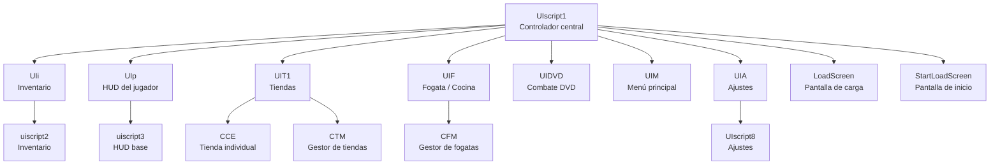

**Principio de funcionamiento:**
Ninguna pantalla se destruye ni se crea en runtime. Todas existen siempre en memoria y se muestran u ocultan cambiando `DisplayStyle.Flex / None`. Esto elimina el costo de instanciado y garantiza transiciones instantáneas.

---

## 2. Sistema de pantallas — UIscript1

`UIscript1` es el director de orquesta de toda la UI. Gestiona qué pantalla es visible en cada momento y coordina la entrada al juego.

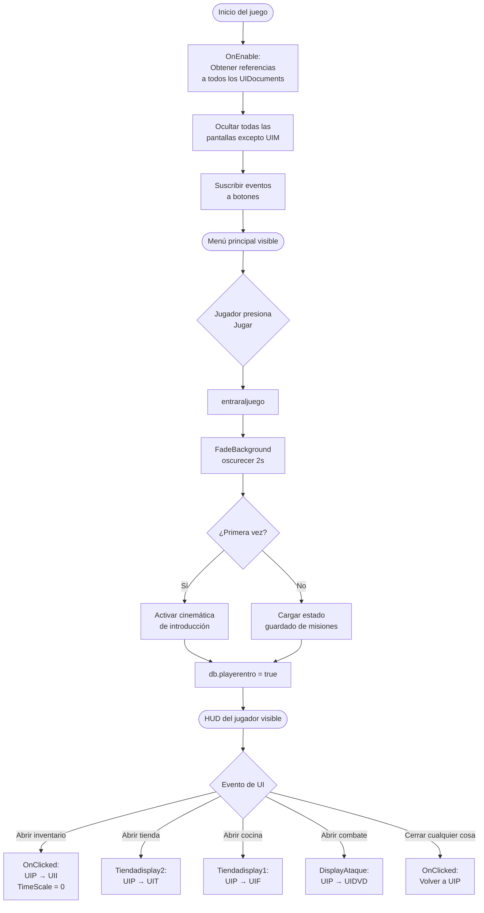

**Función `OnClicked` — el núcleo del sistema:**
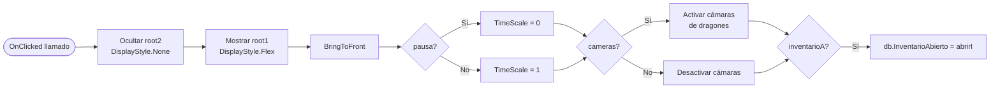

**Sistema de escalado por dispositivo (`metaquerist`):**
Al iniciar, detecta el DPI y tamaño de pantalla para escalar todos los textos de la UI proporcionalmente. Distingue entre móvil, laptop y monitor grande, ajustando `fontSize` de cada elemento mediante su `resolvedStyle`.

---

## 3. Sistema de inventario — uiscript2

El inventario muestra armas, armaduras, consumibles, dragones capturados y el mapa. Usa `ScrollView` y elementos generados dinámicamente desde las listas de `DataBase1`.

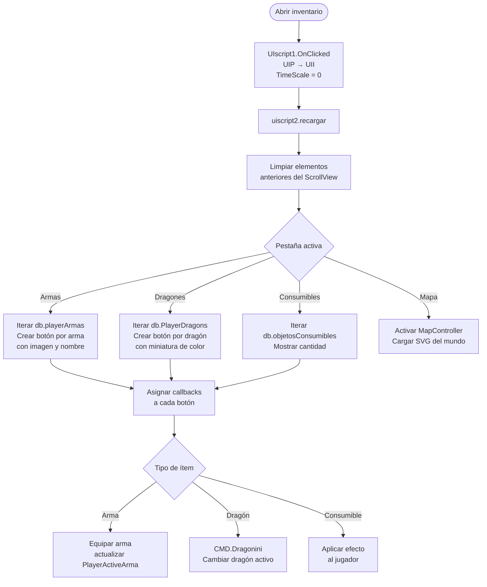

**Miniaturas dinámicas de dragones:**
Cada dragón capturado tiene su color único guardado en `DataBase1.PlayerDragons`. Al mostrar el inventario, el ícono del dragón se genera con ese color aplicado como tinte sobre la textura base, manteniendo coherencia visual con el dragón que el jugador vio en el mundo.

---

## 4. UI del jugador — uiscript3

`uiscript3` gestiona el HUD permanente del jugador: barra de vida, stamina, dinero, botón de acción contextual y notificaciones de objetos obtenidos.

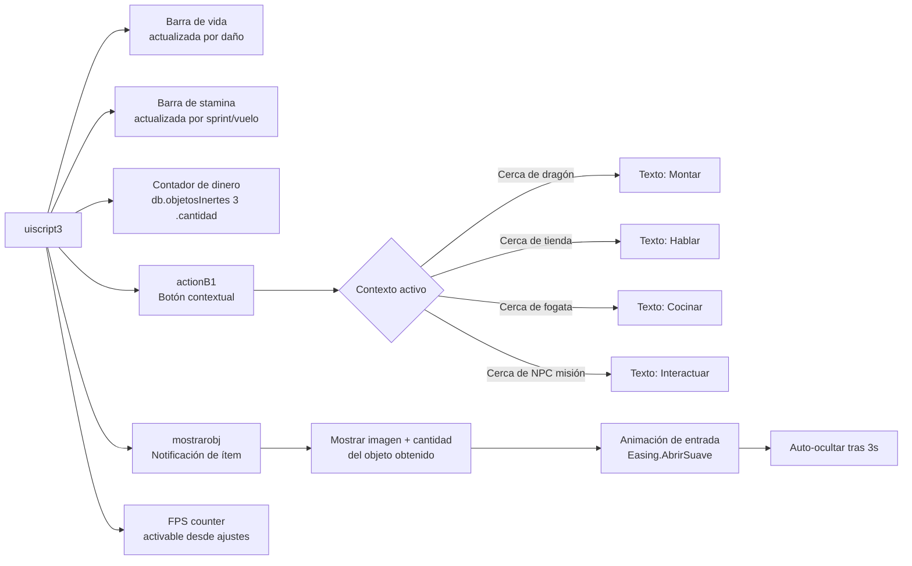

---

## 5. Sistema de tiendas — CCE + CTM

El sistema de tiendas usa dos capas: `CCE` (tienda individual en el mundo) y `CTM` (gestor central que maneja la UI compartida entre todas las tiendas).

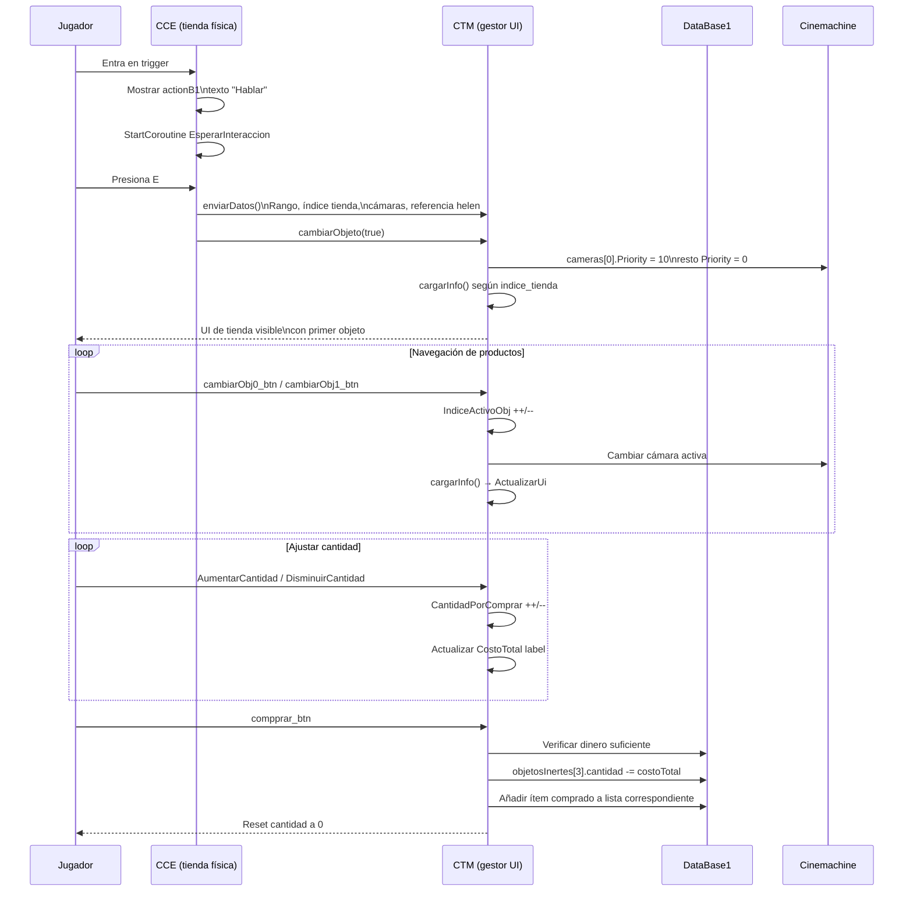

**Tipos de tienda por `indice_tienda`:**

| Índice | Contenido | Lista en DataBase1 |
|--------|-----------|-------------------|
| 0 | Peces (comida dragones) | `db.pez` |
| 2 | Frutas y consumibles | `db.objetosConsumibles[10-12]` |
| 6 | Hongos | `db.objetosConsumibles[5-9]` |
| 7 | Vegetales | `db.objetosConsumibles[13-16]` |
| 8 | Carne | `db.objetosConsumibles[3]` |

**Cámaras por Cinemachine:**
Cada producto de la tienda tiene su propia `CinemachineVirtualCamera`. Al cambiar de producto, CTM baja la prioridad de todas las cámaras a 0 y sube a 10 solo la cámara del producto activo. La Main Camera sigue automáticamente la de mayor prioridad sin código adicional.

> 📸 *[Insertar GIF navegando entre productos en la tienda con cambio de cámara]*

---

## 6. Sistema de cocina — CF + CFM

El sistema de cocina usa el patrón **Singleton Manager + Instancia individual**: `CFM` es el gestor global (singleton) y cada fogata en el mundo es una instancia de `CF` que se registra en él.

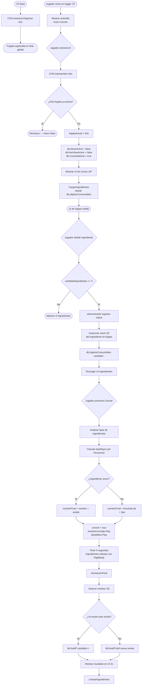

**Nomenclatura de recetas:**
```
1 ingrediente solo    → "[nombre] asada"        ej: "Hongo asado"
2-4 ingredientes      → "brocheta de [tipo]"    ej: "brocheta de hongos rauda"
El tipo se determina por cuál tipo de ingrediente aparece más veces
```

**Efectos visuales durante cocción:**
Los meshes 3D de los ingredientes tienen `Rigidbody`. Durante los 5 segundos de cocción, cada 0.2 segundos se aplica un `AddForce` con valores aleatorios pequeños, haciendo que los ingredientes reboten dentro de la fogata de forma orgánica.

> 📸 *[Insertar GIF del proceso de cocción mostrando los ingredientes 3D y el efecto de partículas]*

---

## 7. Mapa interactivo — MapController

`MapController` implementa un mapa SVG interactivo con zoom, pan por mouse y navegación completa por gamepad, sin depender de ninguna librería externa.

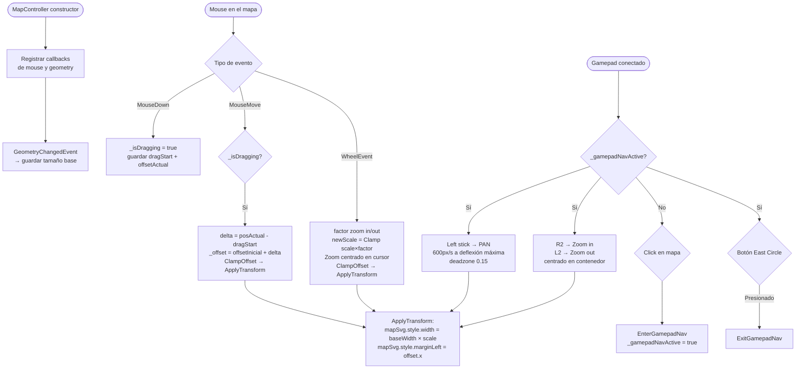

**ClampOffset — límites del mapa:**
Impide que el usuario mueva el mapa más allá de sus bordes. Calcula el rango válido de offset comparando el tamaño del mapa escalado contra el tamaño del contenedor, asegurando que siempre haya contenido visible.

```
offsetX mínimo = contW - mapW    (borde derecho del mapa alineado con borde derecho del contenedor)
offsetX máximo = 0               (borde izquierdo del mapa alineado con borde izquierdo del contenedor)
```

> 📸 *[Insertar GIF del mapa SVG con zoom y pan mostrando las regiones de Eteria]*

---

## 8. Sistema de ajustes — UIscript8

Menú de ajustes con 4 secciones: General, Sonido, Controles y Gráficos. Cada sección es un `VisualElement` que se muestra u oculta al cambiar de pestaña.

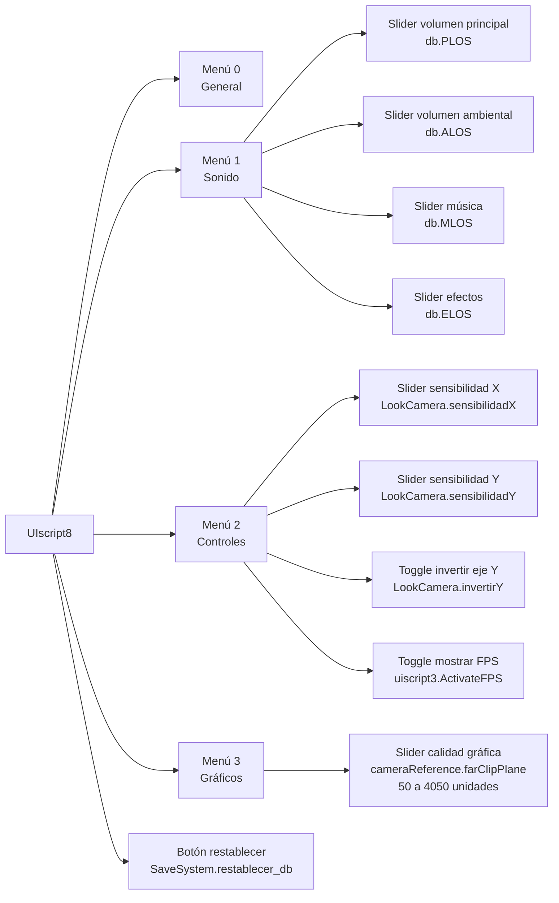

Los valores se leen cada segundo desde una corrutina en lugar de en cada frame, reduciendo el costo de actualización de parámetros de audio y cámara.

---

## 9. Efectos de transición — FadeBackground + Easing

### FadeBackground
Fade a negro y de vuelta usando una `Image` UGUI con alpha animado. Se usa en: entrada al juego, inicio de combate, carga de escena.

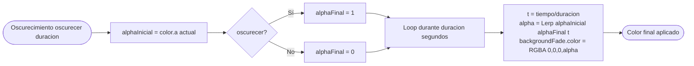

### Easing
Librería estática de funciones de interpolación usada en animaciones de UI y transiciones de cámara.

| Función | Uso en el juego |
|---------|----------------|
| `InOutSine` | Rotación del dragón enemigo al iniciar combate |
| `BackOut` | Rotación de cámara al iniciar combate (llega rápido, asienta suave) |
| `AbrirSuave` | Aparición de pantallas UI con animación de entrada |

---

## 10. Canvas mixto 3D y UI

Eteria World usa simultáneamente dos sistemas de renderizado de UI:

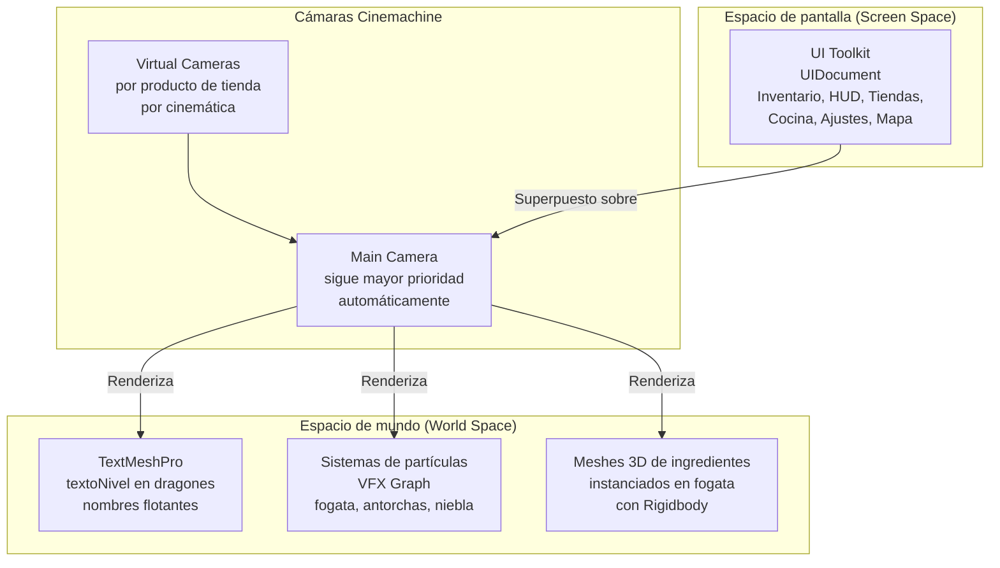

**Por qué UI Toolkit en lugar de Canvas:**
Unity Canvas genera draw calls por cada elemento gráfico visible. UI Toolkit agrupa los elementos del mismo documento en una sola pasada de renderizado. Con la cantidad de elementos UI del juego (HUD, inventario, tiendas, ajustes), esto representa una reducción significativa de draw calls solo en la capa de interfaz.

Los elementos 3D que coexisten con la UI (ingredientes en fogata, niveles de dragones, partículas) se renderizan en espacio de mundo y se ven "a través" de la cámara principal, creando la ilusión de UI integrada con el mundo sin costo adicional de Canvas en World Space.

> 📸 *[Insertar captura mostrando el HUD sobre el mundo 3D con partículas de fogata visibles al mismo tiempo]*

---

> 📸 *Capturas sugeridas:*
> - `docs/assets/sistemas/inventario-dragones.png` — inventario con miniaturas de color
> - `docs/assets/sistemas/tienda-camaras.gif` — cambio de cámara al navegar productos
> - `docs/assets/sistemas/cocina-proceso.gif` — ingredientes rebotando en fogata
> - `docs/assets/sistemas/mapa-svg.gif` — zoom y pan del mapa interactivo
