# 🌍 Sistema de Mundo, NPCs, Animales y Recolección — Eteria World

> Documentación técnica de los sistemas que dan vida al mundo abierto de Eteria: comportamiento de NPCs, animales, spawneo, recolección de recursos, clima, ciclo día/noche, niebla volumétrica y antorchas. Todos estos sistemas priorizan el rendimiento mediante LOD lógico y activación por distancia.

**Scripts involucrados:** `NPC_behavior.cs` · `SpawnNpc.cs` · `COV.cs` (Animal base) · `SAC.cs` · `rockD.cs` · `CCL.cs` · `CDN.cs` · `fogPoint.cs` · `Vfx_antorcha.cs`

---

## Índice

1. [Arquitectura general del mundo](#1-arquitectura-general-del-mundo)
2. [Sistema de NPCs — NPC_behavior + SpawnNpc](#2-sistema-de-npcs--npc_behavior--spawnnpc)
3. [Sistema de animales — Animal + COV + SAC](#3-sistema-de-animales--animal--cov--sac)
4. [Sistema de recolección — rockD](#4-sistema-de-recolección--rockd)
5. [Sistema de clima — CCL](#5-sistema-de-clima--ccl)
6. [Ciclo día/noche — CDN](#6-ciclo-díanoche--cdn)
7. [Niebla volumétrica — fogPoint](#7-niebla-volumétrica--fogpoint)
8. [Antorchas con LOD — Vfx_antorcha](#8-antorchas-con-lod--vfx_antorcha)
9. [Integración entre sistemas](#9-integración-entre-sistemas)

---

## 1. Arquitectura general del mundo

Todos los sistemas del mundo se comunican a través de `DataBase1` y reaccionan al estado global del juego sin acoplamiento directo entre sí.

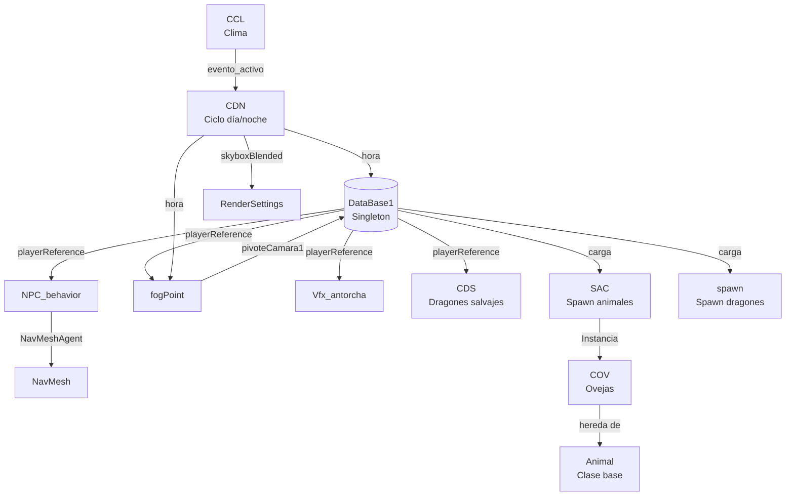

---

## 2. Sistema de NPCs — NPC_behavior + SpawnNpc

### 2.1 Spawneo de NPCs (`SpawnNpc.cs`)

El sistema genera NPCs con apariencia única combinando texturas de pelo, cara y ropa sin duplicar materiales.

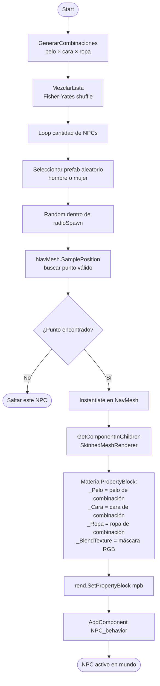

**Por qué `MaterialPropertyBlock` y no materiales únicos:**
Con 10 NPCs, 3 opciones de pelo, 3 de cara y 3 de ropa hay 27 combinaciones posibles. Crear un material por combinación generaría 27 materiales únicos, rompiendo el batching. Con `MaterialPropertyBlock`, todos los NPCs comparten el mismo material base y la GPU recibe los parámetros de textura por instancia, manteniendo el batching activo.

### 2.2 Comportamiento de NPCs (`NPC_behavior.cs`)

Sistema de deambulación autónoma con LOD lógico completo: cuando el jugador está lejos, el NPC se congela completamente — sin Update, sin NavMesh, sin animación.

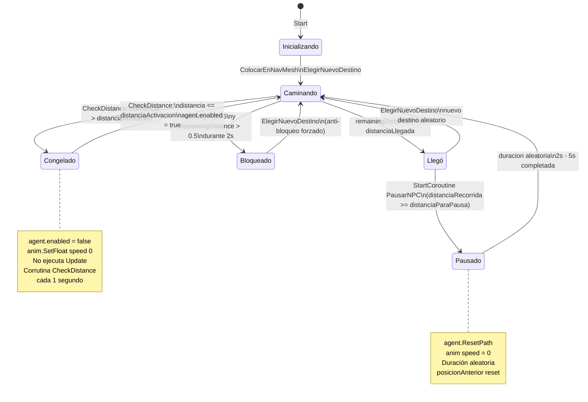

**Sistema de pausa inteligente:**
En lugar de que los NPCs caminen indefinidamente, acumulan distancia recorrida. Al superar `distanciaParaPausa` (8 unidades por defecto), se detienen durante un tiempo aleatorio (2-5 segundos) simulando comportamiento natural como mirar alrededor o descansar.

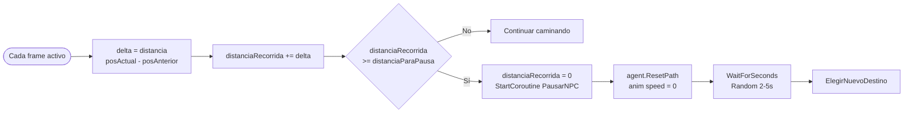

**ElegirNuevoDestino — selección robusta:**
Hace hasta 8 intentos para encontrar un punto válido en el NavMesh. Verifica que el path calculado tenga estado `PathComplete` antes de asignarlo, descartando puntos en islas de NavMesh separadas donde el NPC quedaría atrapado.

**Configuración del NavMeshAgent para multitud:**
```
speed:              Random 1.8 - 2.8 m/s    (velocidad variable evita sincronización)
radius:             0.22                      (radio pequeño → pueden pasar cerca)
avoidancePriority:  Random 20 - 80           (prioridad variable → no todos ceden a la vez)
obstacleAvoidance:  LowQualityObstacleAvoidance (suficiente para NPCs de fondo)
```

> 📸 *[Insertar GIF de la aldea con múltiples NPCs deambulando con comportamiento natural]*

---

## 3. Sistema de animales — Animal + COV + SAC

### 3.1 Spawneo de animales (`SAC.cs`)

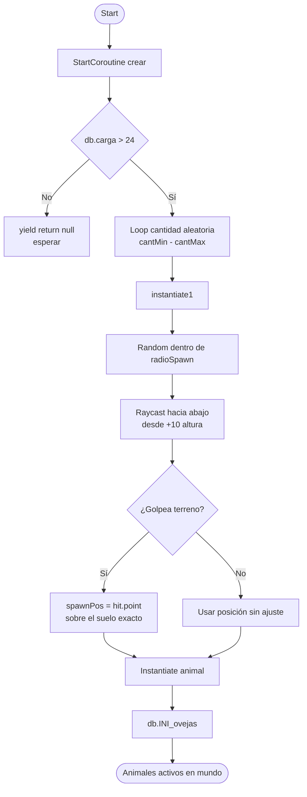

### 3.2 Clase base Animal y comportamiento (`COV.cs`)

La clase `Animal` es una clase base que define el sistema de vida, recompensas y muerte. `COV` (oveja) hereda de ella y configura sus parámetros específicos.

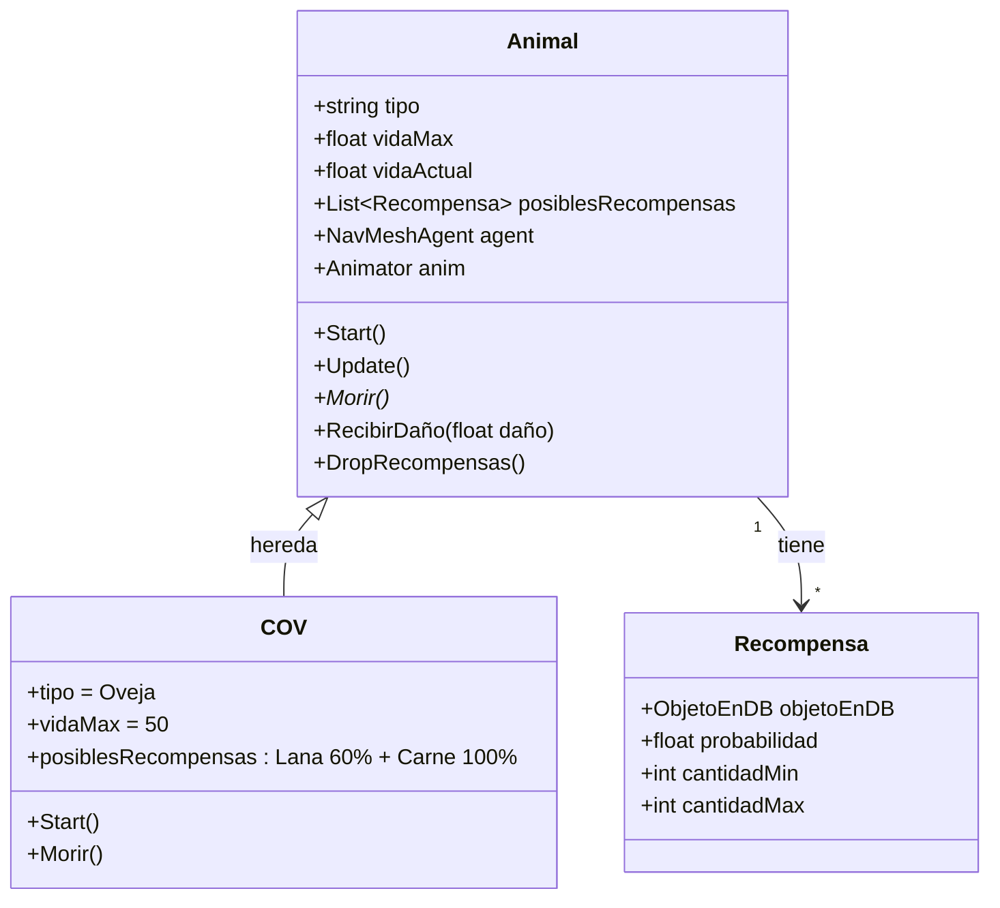

**Sistema de recompensas al morir (COV):**

| Recompensa | Probabilidad | Cantidad |
|-----------|-------------|---------|
| Lana (`objetosInertes[0]`) | 60% | 1 - 6 |
| Carne (`objetosConsumibles[0]`) | 100% | 1 - 7 |

La probabilidad se evalúa con `Random.value < probabilidad` por cada recompensa independientemente, por lo que una oveja puede soltar ambas, solo una, o solo la garantizada (carne).

---

## 4. Sistema de recolección — rockD

Las rocas interactuables requieren un arma de minería específica para romperse. El sistema detecta el arma activa del jugador dentro de un trigger y verifica si puede hacer daño en el frame actual.

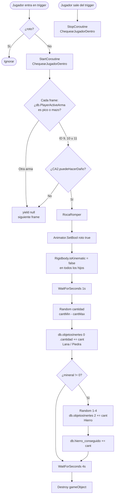

**Por qué corrutina en lugar de Update:**
Verificar el arma activa y el estado de daño en cada frame (60 veces/segundo) para cada roca en la escena es costoso. La corrutina solo existe mientras el jugador está dentro del trigger, y se detiene automáticamente al salir, eliminando todo costo cuando el jugador no está interactuando con la roca.

---

## 5. Sistema de clima — CCL

El clima cambia automáticamente cada cierto intervalo con probabilidad configurable. Puede ser forzado por eventos de misión.

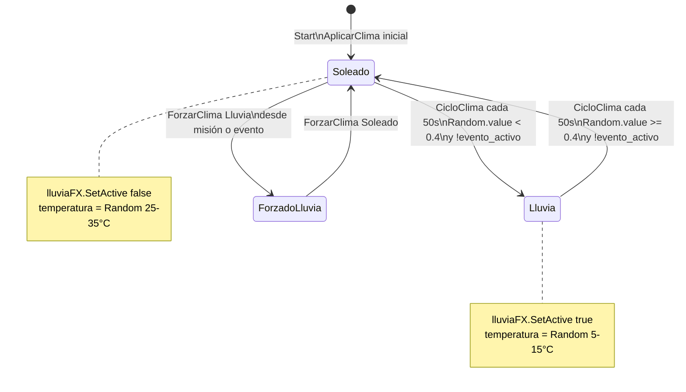

**`evento_activo`:** Cuando una misión o cinemática requiere un clima específico, activa este flag para bloquear los cambios automáticos. Así el clima se mantiene fijo durante el evento y vuelve al ciclo normal al terminar.

---

## 6. Ciclo día/noche — CDN

El ciclo día/noche blenda entre 5 texturas de skybox panorámico según la hora actual, con velocidad acelerada durante la noche para que no sea aburrida.

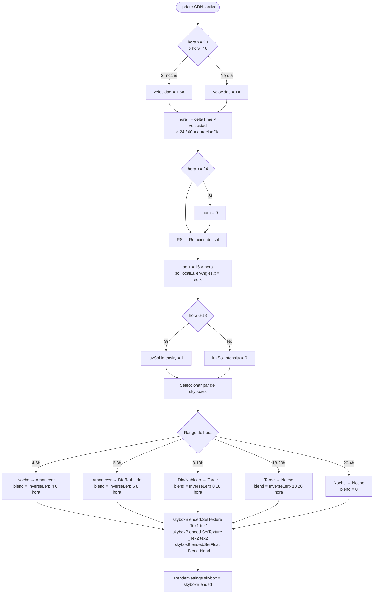

**Integración con clima:**
En el rango 6-8h (amanecer → día), si `CCL.evento_activo` está activado, se usa `skyboxNublado` en lugar de `skyboxDia`. Esto hace que el skybox responda automáticamente al estado del clima sin código adicional en CCL.

**5 texturas de skybox:**

| Textura | Rango horario |
|---------|--------------|
| `skyboxNoche` | 20h - 6h |
| `skyboxAmanecer` | 4h - 8h (transición) |
| `skyboxDia` | 6h - 18h |
| `skyboxNublado` | 6h - 18h (si llueve) |
| `skyboxTarde` | 8h - 20h (transición) |

> 📸 *[Insertar GIF del ciclo día/noche mostrando las 5 transiciones de skybox]*

---

## 7. Niebla volumétrica — fogPoint

Cada punto de niebla en el mundo es un VFX Graph que se activa y ajusta su densidad según la distancia al jugador. El sistema tiene zona de aparición gradual y zona de desvanecimiento suave más allá del radio máximo.

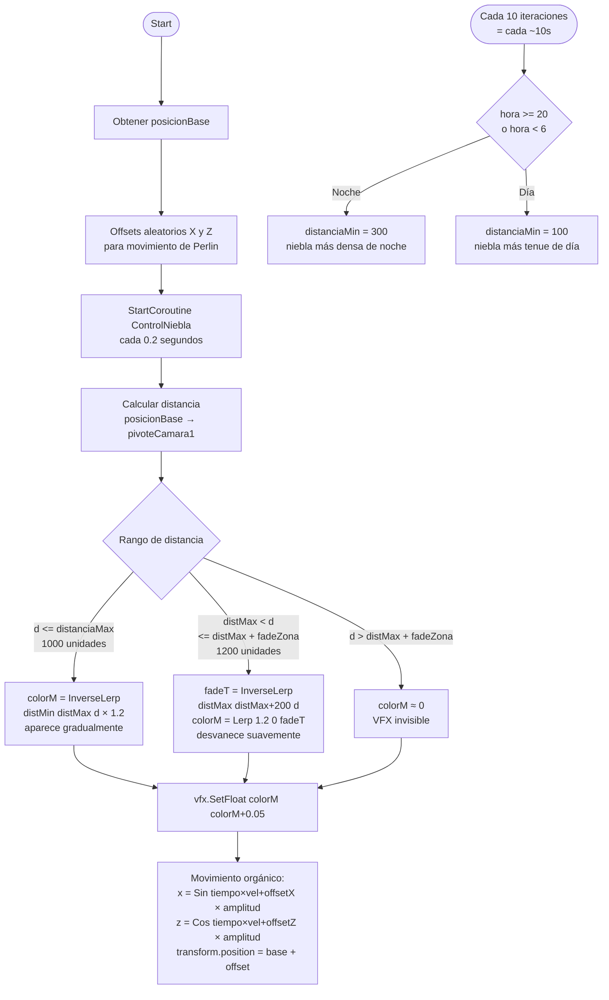

**Por qué 0.2s y no Update:**
La niebla no necesita actualizarse 60 veces por segundo. Los cambios de densidad y posición son imperceptibles a esa frecuencia. Actualizar a 5Hz (cada 0.2s) reduce el costo de CPU de todos los puntos de niebla en un 92% respecto a Update, sin diferencia visual.

---

## 8. Antorchas con LOD — Vfx_antorcha

Cada antorcha del mundo tiene un VFX Graph de llama y una luz puntual. Ambos se desactivan automáticamente cuando el jugador está lejos, usando `InvokeRepeating` en lugar de Update.

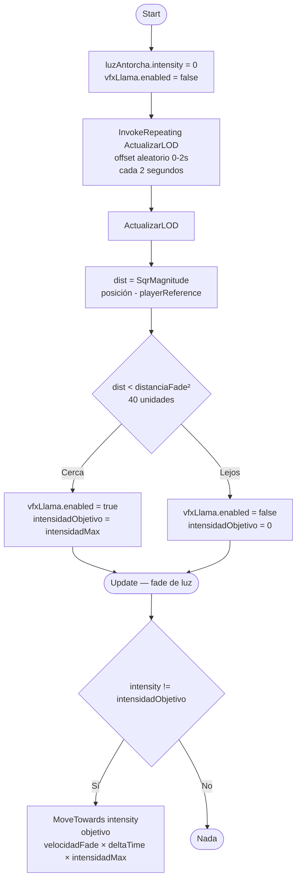

**Offset aleatorio en InvokeRepeating:**
Todas las antorchas no se actualizan en el mismo frame. El offset inicial aleatorio (0-2 segundos) distribuye las actualizaciones a lo largo del tiempo, evitando picos de CPU cuando muchas antorchas están visibles simultáneamente.

**SqrMagnitude en lugar de Distance:**
`Vector3.Distance` calcula una raíz cuadrada, que es costosa. `SqrMagnitude` devuelve el cuadrado de la distancia sin raíz cuadrada. Comparar con `distanciaFade²` es matemáticamente equivalente y más eficiente, especialmente cuando hay decenas de antorchas en escena.

---

## 9. Integración entre sistemas

Todos los sistemas del mundo reaccionan a los mismos datos centrales sin comunicarse directamente entre sí.

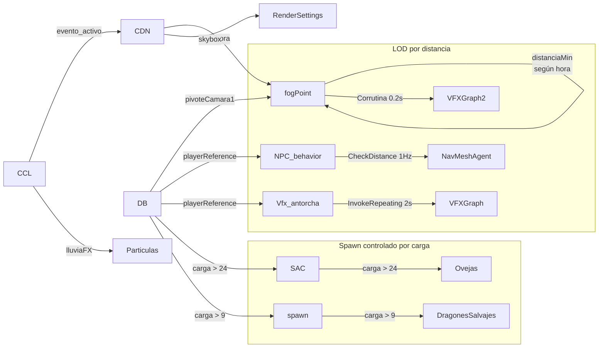

**Sistema de carga (`db.carga`):**
Los sistemas de spawn no se activan inmediatamente al inicio. Esperan a que `db.carga` supere un umbral, evitando que todos los sistemas inicialicen simultáneamente en el primer frame y causando picos de CPU en la carga del juego. Los dragones salvajes esperan `carga > 9` y los animales esperan `carga > 24`, escalonando la inicialización.

---

> 📸 *Capturas sugeridas:*
> - `docs/assets/sistemas/npcs-aldea.gif` — NPCs deambulando con pausas naturales
> - `docs/assets/sistemas/ciclo-dia-noche.gif` — transición completa de skybox
> - `docs/assets/sistemas/niebla-volumetrica.png` — efecto de niebla en zona boscosa
> - `docs/assets/sistemas/roca-recoleccion.gif` — animación de roca rompiéndose
> - `docs/assets/sistemas/antorcha-lod.gif` — antorcha activándose al acercarse
