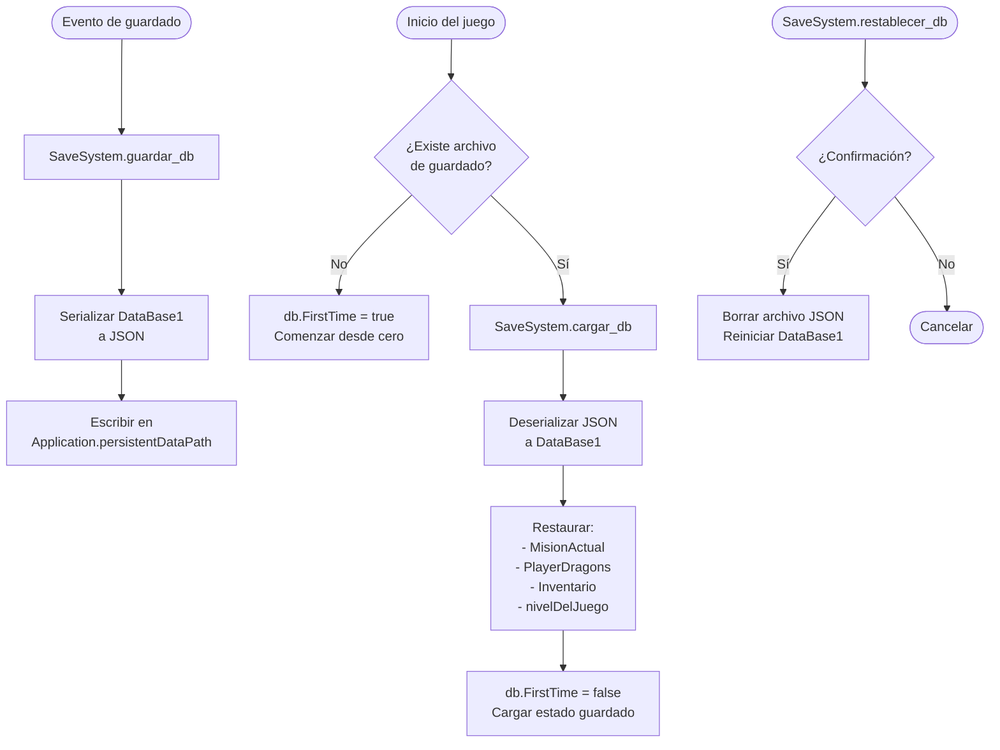
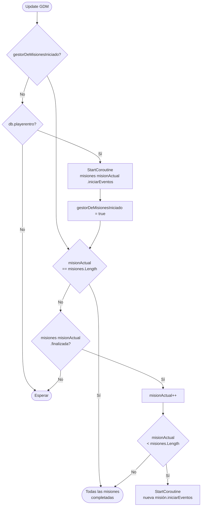
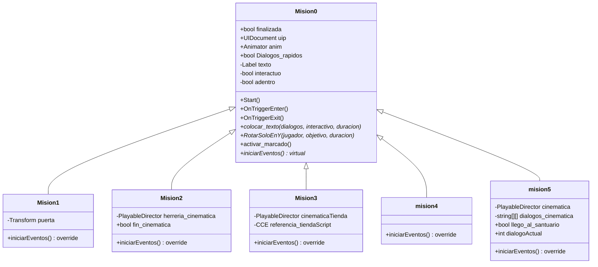
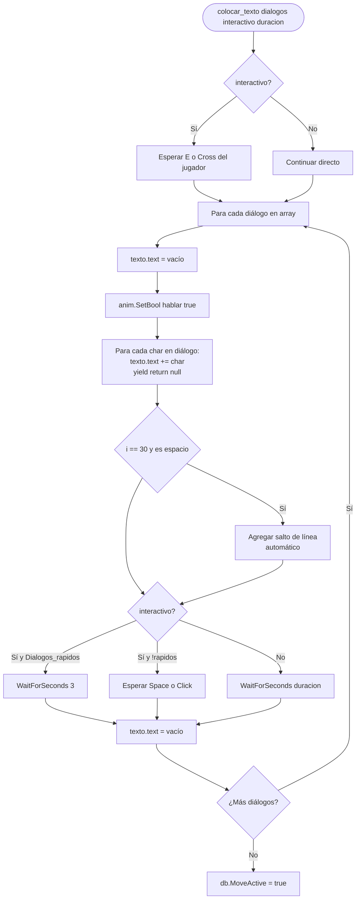
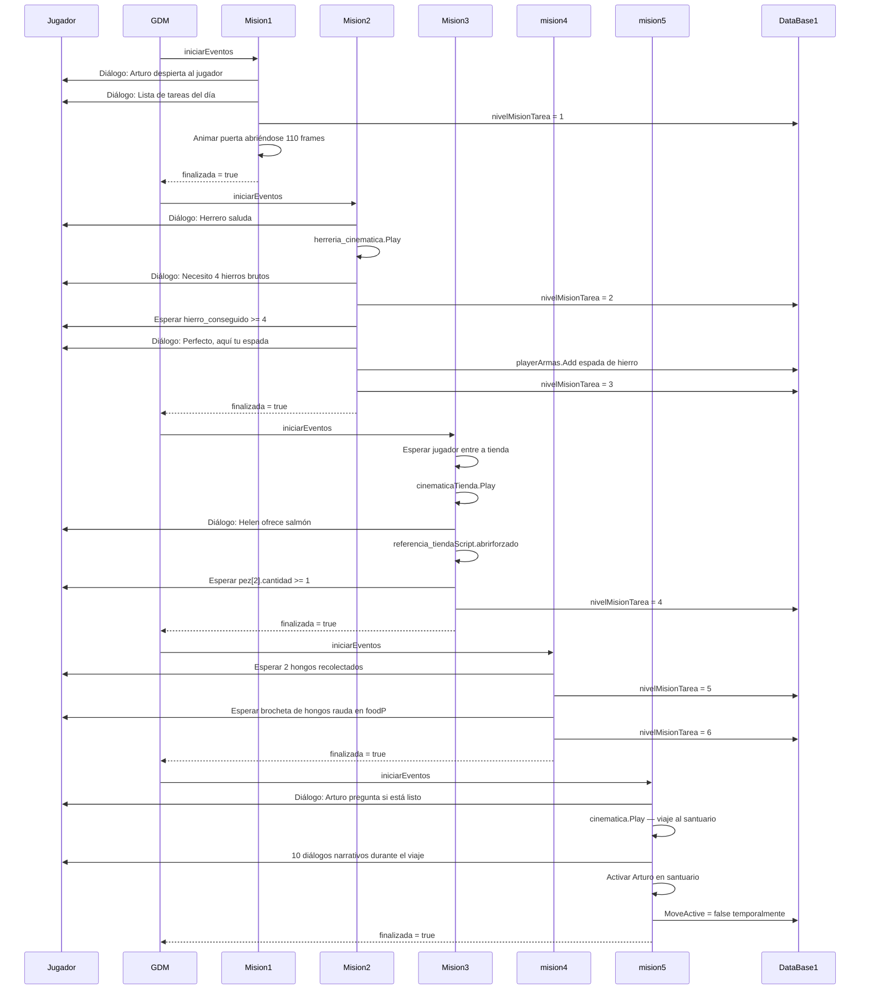
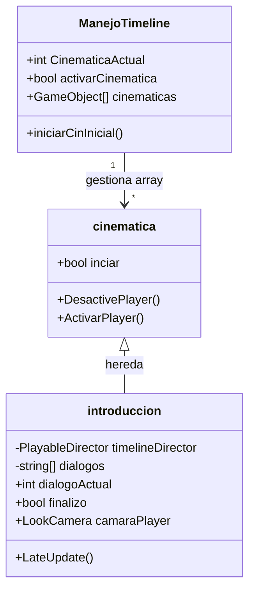
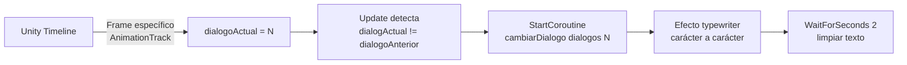
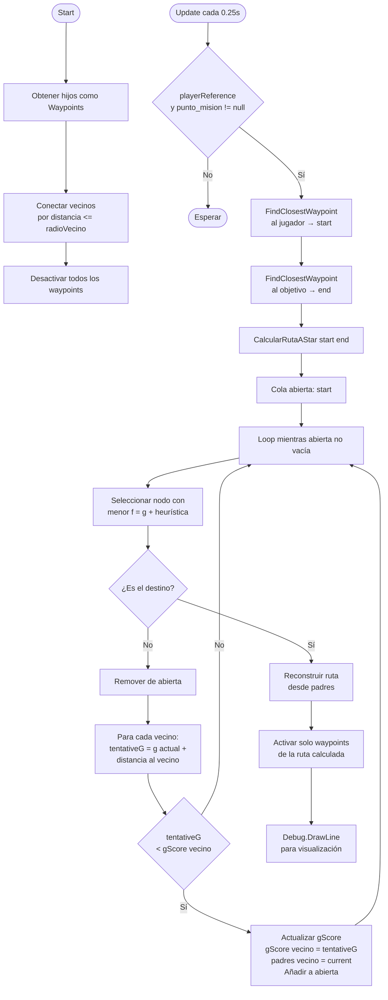

# 🗃️ DataBase1, Misiones y Sistema Narrativo — Eteria World

> Documentación técnica del singleton central del juego, el sistema de misiones encadenadas con herencia de clases, el gestor de cinemáticas y el sistema de narrativa. Estos sistemas forman la columna vertebral arquitectural del proyecto.

**Scripts involucrados:** `DataBase1.cs` · `GDM.cs` · `Mision0.cs` · `Mision1-5.cs` · `Manejo_Timeline.cs` · `introduccion.cs` · `raycast-line.cs`

---

## Índice

1. [DataBase1 — Singleton central](#1-database1--singleton-central)
2. [Sistema de guardado](#2-sistema-de-guardado)
3. [Gestor de misiones — GDM](#3-gestor-de-misiones--gdm)
4. [Arquitectura de misiones — Mision0 + herencia](#4-arquitectura-de-misiones--mision0--herencia)
5. [Cadena narrativa completa — Misiones 1 a 5](#5-cadena-narrativa-completa--misiones-1-a-5)
6. [Sistema de cinemáticas — Manejo_Timeline + introduccion](#6-sistema-de-cinemáticas--manejo_timeline--introduccion)
7. [Sistema de waypoints A* — raycast-line](#7-sistema-de-waypoints-a--raycast-line)

---

## 1. DataBase1 — Singleton central

`DataBase1` es el punto de acceso global a todo el estado del juego. Ningún sistema guarda estado propio relevante — todo pasa por aquí. Esto garantiza que cualquier script puede leer o modificar el estado del juego sin referencias directas entre sí.

```mermaid
graph TD
    subgraph "Referencias de escena"
        PR[playerReference]
        CAM[cameraReference]
        ANIM[PlayerAnimator1]
        MT2[MT — ManejoTimeline]
        CDN2[clima_reference — CCL]
        FOG2[PivoteFog]
        GDM2[gestorDeMisiones]
    end

    subgraph "Estado del jugador"
        MA[MoveActive]
        FVA[freeViewActive]
        DA[dragonAc — montado]
        VOL[volar]
        PA[peleaActiva]
        INV[InventarioAbierto]
        COC[CocinaAbierta]
        TIE[tiendaAbierta]
    end

    subgraph "Inventario del jugador"
        PD[PlayerDragons\nList DragonData]
        PAR[playerArmas\nList Arma]
        PAA[PlayerActiveArma]
        PEZ[pez\nList PezData]
        OBJ[objetosConsumibles]
        OBI[objetosInertes]
        FOOD[foodP\nList foodsP]
    end

    subgraph "Estado del mundo"
        NIV[nivelDelJuego]
        HORA[hora — CDN]
        NMIS[MisionActual]
        NTASK[nivelMisionTarea]
        CARGA[carga]
        FT[FirstTime]
        PE[playerentro]
    end

    subgraph "Dragones del mundo"
        DAC[dragonactivo\nGameObject]
        DRAC[dragones\nList DragonBase]
        TEX[textura\nList Texture2D]
        PAT[patron1... Material]
    end

    DB[(DataBase1\nInstancia)] --> PR & CAM & ANIM & MT2 & CDN2 & FOG2 & GDM2
    DB --> MA & FVA & DA & VOL & PA & INV & COC & TIE
    DB --> PD & PAR & PAA & PEZ & OBJ & OBI & FOOD
    DB --> NIV & HORA & NMIS & NTASK & CARGA & FT & PE
    DB --> DAC & DRAC & TEX & PAT
```



**Por qué un singleton y no ScriptableObjects:**
El estado del juego es altamente dinámico y muchos sistemas necesitan leer y escribir el mismo dato en el mismo frame. Un singleton en memoria es la opción más directa y performante para este caso. Los ScriptableObjects son ideales para datos estáticos de diseño, no para estado en tiempo real.

**Patrón de acceso:**
```csharp
// Cualquier script accede así, sin referencias en Inspector:
DataBase1 db = DataBase1.Instancia;
db.MoveActive = false;
db.PlayerDragons[0].vida = 100;
```

---

## 2. Sistema de guardado

El juego guarda y carga el estado completo mediante `SaveSystem`, que serializa `DataBase1` a JSON en disco.



**Datos que se persisten:**

| Categoría | Datos guardados |
|-----------|----------------|
| Progreso | `MisionActual`, `nivelMisionTarea`, `nivelDelJuego` |
| Dragones | `PlayerDragons` — vida, stats, color, textura de cada dragón |
| Inventario | `playerArmas`, `pez`, `objetosConsumibles`, `objetosInertes`, `foodP` |
| Estado | `FirstTime`, `hierro_conseguido` |

---

## 3. Gestor de misiones — GDM

`GDM` orquesta la cadena de misiones de forma lineal. Espera a que cada misión termine antes de iniciar la siguiente, usando el flag `finalizada` de cada instancia.



**Por qué corrutinas y no Update para las misiones:**
Cada misión tiene una secuencia de eventos con tiempos específicos entre diálogos, cinemáticas y condiciones. Implementarlo en Update requeriría máquinas de estado explícitas con muchos flags. Con corrutinas, el flujo se lee secuencialmente como un guion: `yield return dialogo` → `yield return cinematica` → `yield return condicion`, exactamente en el orden que ocurre en el juego.

---

## 4. Arquitectura de misiones — Mision0 + herencia

`Mision0` es la clase base que provee todos los servicios que una misión puede necesitar. Cada misión concreta hereda de ella y solo implementa su propia secuencia de eventos.



**`colocar_texto` — sistema de diálogo:**
La función más usada en todo el sistema narrativo. Escribe el texto carácter por carácter (efecto typewriter), activa la animación de hablar del NPC y espera según el modo:



---

## 5. Cadena narrativa completa — Misiones 1 a 5



**Progreso de `nivelMisionTarea`:**

| Valor | Estado |
|-------|--------|
| 0 | Inicio — sin tareas |
| 1 | Ir a herrería |
| 2 | Recolectar 4 hierros |
| 3 | Comprar salmón |
| 4 | Recolectar hongos |
| 5 | Cocinar brocheta |
| 6 | Ir al santuario |

Este valor se guarda en `DataBase1` y se persiste en el archivo de guardado, permitiendo retomar el progreso exacto de misión al recargar el juego.

---

## 6. Sistema de cinemáticas — Manejo_Timeline + introduccion

### 6.1 Arquitectura de cinemáticas (`Manejo_Timeline.cs`)



**Por qué herencia en lugar de switch/if:**
Con herencia, `ManejoTimeline` solo llama `cinematicas[i].GetComponent<cinematica>().inciar = true` sin saber qué tipo de cinemática es. Agregar una nueva cinemática es crear una nueva clase que hereda de `cinematica` e implementar su propia lógica, sin modificar el gestor.

### 6.2 Flujo de la cinemática de introducción

```mermaid
flowchart TD
    A([db.FirstTime == true]) --> B[UIscript1.entraraljuego]
    B --> C[db.MT.activarCinematica = true\ndb.MT.iniciarCinInicial]
    C --> D[introduccion.inciar = true]

    D --> E[LateUpdate detecta inciar]
    E --> F[Mover player a origen 0,0,0]
    F --> G[ui1.activar_UI false\nOcultar HUD]
    G --> H[DesactivePlayer\ndb.MoveActive = false]
    H --> I[sonidoMusica.SetActive false]
    I --> J[timelineDirector.Play\nInicia Timeline Unity]

    J --> K[Timeline ejecuta secuencia]
    K --> L[4 escenarios con\nVirtual Cameras distintas]
    L --> M[Diálogos narrados\ntipo letra a letra]
    M --> N[Dragón Scarn cruza\nel encuadre como transición]

    N --> O{finalizo == true}
    O --> O2{db.MisionActual == 0}
    O2 -->|Sí| P[Mover player a posición\nde inicio del juego]
    P --> Q[ui1.activar_UI true\nMostrar HUD]
    Q --> R[ActivarPlayer\ndb.MoveActive = true]
    R --> S[camaraPlayer.ActivarPrimeraPersona true\nInicio en cama]
    S --> T[gdm.iniciarColdown\nEsperar antes de primera misión]
    T --> U[sonidoMusica.SetActive true]
    U --> V([Jugador en control\ncomienza Mision1])
```



**Sistema de diálogos sincronizados con Timeline:**
La cinemática de introducción tiene diálogos que deben aparecer en momentos específicos del Timeline. En lugar de usar eventos del Timeline directamente, `introduccion.cs` expone la propiedad pública `dialogoActual`. El Timeline modifica este valor en el momento exacto mediante `AnimationTrack`, y `Update` detecta el cambio comparando con `dialogoAnterior`, disparando el efecto typewriter.



**4 escenarios de la introducción:**

| Escenario | Frames | Virtual Camera | Descripción |
|-----------|--------|---------------|-------------|
| Cerro de Chirripó | 0 - 600 | VCam_Chirripó | Vista del mundo desde las alturas |
| Llanura de Ámbar | 600 - 1200 | VCam_Ambar | Dragón Scarn cruza la escena |
| Campo de entrenamiento | 1200 - 1800 | VCam_Campo | Pendiente de desarrollo |
| Llanura de Scarn | 1800 - 2400 | VCam_Scarn | Llegada al santuario |

---

## 7. Sistema de waypoints A* — raycast-line

`SmartWaypointPath` implementa el algoritmo A* sobre una red de waypoints para calcular la ruta más corta entre el jugador y el punto de misión activo. Actualmente en desarrollo, no activo en el juego.



**Heurística usada:** Distancia euclidiana directa al destino (`Vector3.Distance`), que es admisible (nunca sobreestima) en un espacio 3D sin obstáculos entre waypoints.

**Por qué no NavMesh directamente:**
El sistema de waypoints permite mostrar visualmente la ruta al jugador en el mundo como marcadores flotantes, algo que NavMesh no puede hacer de forma nativa sin código adicional. Al activar solo los waypoints de la ruta calculada, el jugador ve una línea de puntos que lo guía al objetivo.

---

> 📸 *Capturas sugeridas:*
> - `docs/assets/sistemas/cinematica-intro.gif` — secuencia de la cinemática de introducción
> - `docs/assets/sistemas/dialogo-typewriter.gif` — efecto typewriter en diálogos de misión
> - `docs/assets/sistemas/mision-progreso.png` — HUD mostrando tarea activa de misión
