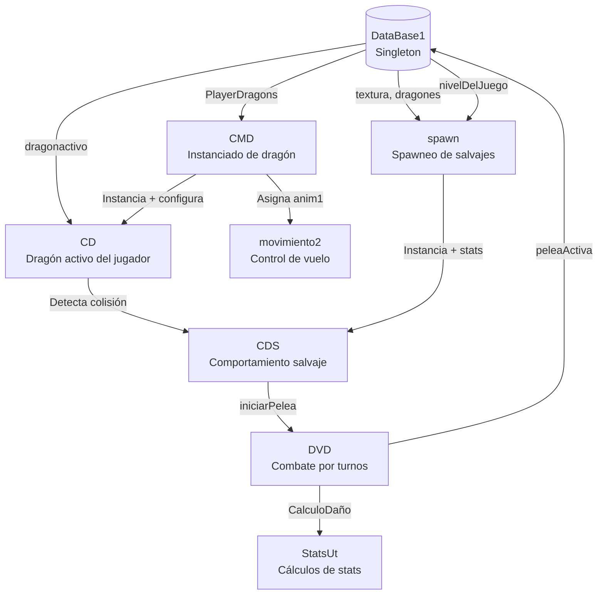
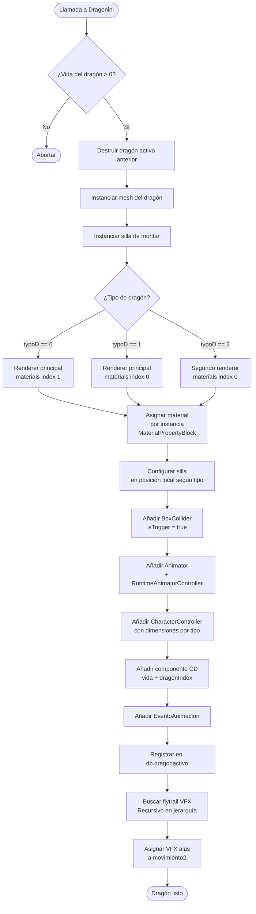
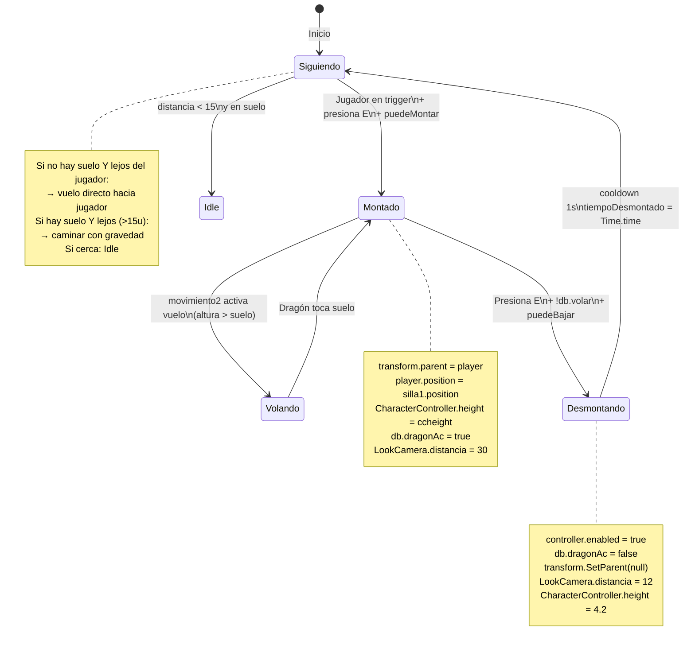
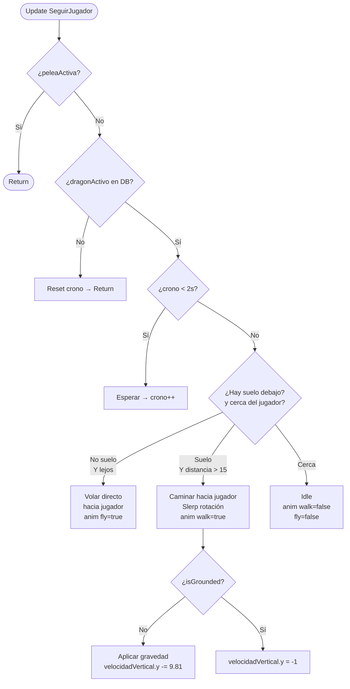
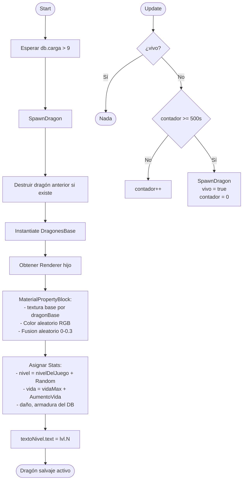
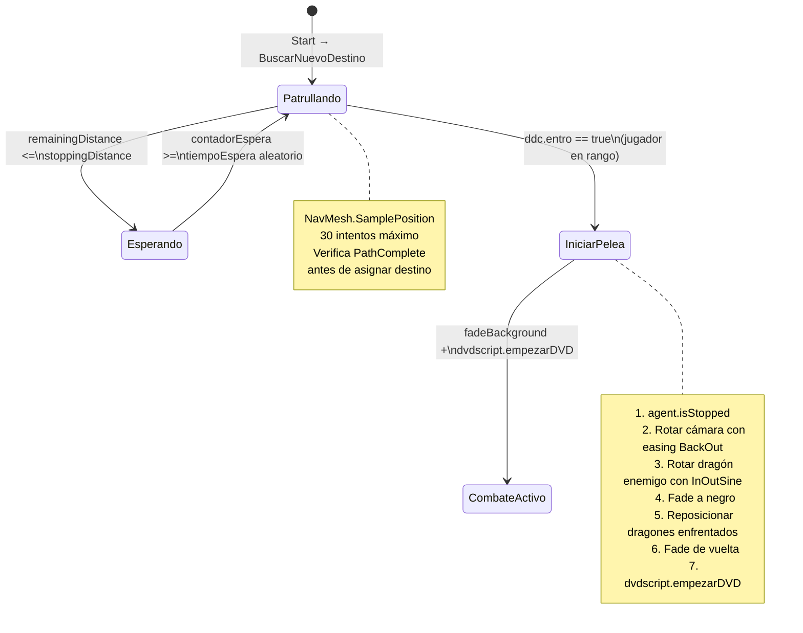
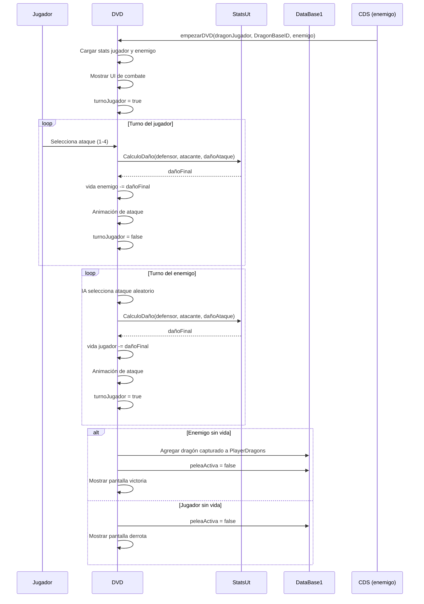
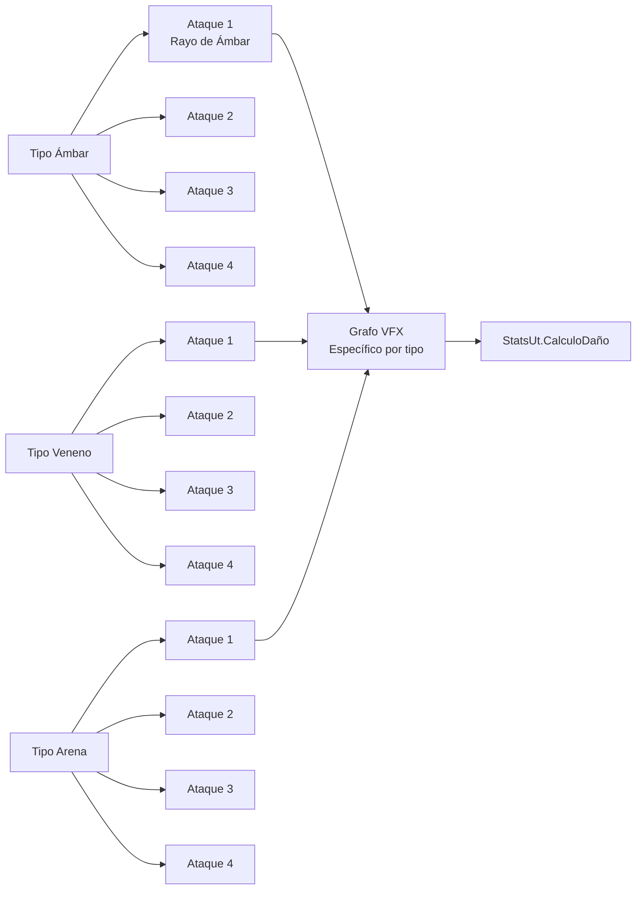

# 🐉 Sistema de Dragones y Combate — Eteria World

> Documentación técnica de los sistemas de dragones: instanciado, montura, comportamiento de dragones salvajes y combate elemental por turnos. Basada directamente en el código fuente.

**Scripts involucrados:** `CMD.cs` · `CD.cs` · `spawn.cs` · `CDS.cs` · `DVD.cs` · `StatsUt.cs`

---

## Índice

1. [Arquitectura general](#1-arquitectura-general)
2. [Sistema de instanciado — CMD](#2-sistema-de-instanciado--cmd)
3. [Máquina de estados del dragón activo — CD](#3-máquina-de-estados-del-dragón-activo--cd)
4. [Sistema de dragones salvajes — spawn + CDS](#4-sistema-de-dragones-salvajes--spawn--cds)
5. [Sistema de combate elemental — DVD + StatsUt](#5-sistema-de-combate-elemental--dvd--statsut)
6. [Fórmula de daño](#6-fórmula-de-daño)

---

## 1. Arquitectura general

Relación entre los scripts del sistema de dragones y cómo se comunican a través del singleton `DataBase1`.



---

## 2. Sistema de instanciado — CMD

`CMD.cs` construye el dragón del jugador en runtime, ensamblando todos sus componentes dinámicamente en lugar de usar prefabs preconstruidos.



**Puntos técnicos destacados:**
- El material se asigna con `MaterialPropertyBlock` — no rompe GPU Instancing
- Todos los componentes (`CD`, `CharacterController`, `Animator`) se añaden en runtime, el prefab solo contiene el mesh
- La posición de la silla varía por array `sillaP[typoD]` según el tipo de dragón
- Los VFX de alas se buscan recursivamente en la jerarquía con `Utilidades.BuscarPorNombreRecursivo`

---

## 3. Máquina de estados del dragón activo — CD

`CD.cs` gestiona todos los estados posibles del dragón que acompaña al jugador: seguimiento, montura, vuelo y desmonte.



**Lógica de seguimiento (SeguirJugador):**



---

## 4. Sistema de dragones salvajes — spawn + CDS

### 4.1 Spawneo (`spawn.cs`)



### 4.2 Comportamiento salvaje (`CDS.cs`)



**Optimización de detección (CDS):**
```
En lugar de verificar distancia en Update (60 veces/segundo):
→ timerCheck acumula Time.deltaTime
→ ComprobarDistancia() se llama cada 0.2s (5 veces/segundo)
→ Usa sqrMagnitude en lugar de Distance (evita sqrt)
```

---

## 5. Sistema de combate elemental — DVD + StatsUt

El combate es por turnos entre el dragón del jugador y un dragón salvaje. `DVD.cs` gestiona la UI, los turnos y las animaciones. `StatsUt.cs` provee todos los cálculos matemáticos.



**Tipos elementales y ataques:**



> 📸 *[Insertar GIF del combate por turnos mostrando la transición de cámara y los ataques]*

---

## 6. Fórmula de daño

`StatsUt.CalculoDaño` es la función central del sistema de combate. Tiene en cuenta nivel, stats individuales y armadura del defensor.

```
Bonus de ataque  = (niveles[2] × 0.025 + 1) × daño × (nivel × 0.02 + 1)
Daño base        = dañoAtaque × bonusAtaque
Defensa %        = (niveles[4] × 0.025 + 1) × armadura × (nivel × 0.02 + 1)
Defensa %        = Clamp(defensa%, 0, 60)        ← máximo 60% de reducción
Daño final       = dañoBase × (1 - defensa%/100)
Daño final       = Max(1, dañoFinal)             ← mínimo 1 de daño siempre
Daño final       = Round(dañoFinal)              ← sin decimales
```

**Sistema de captura (`StatsUt.intentarCaptura`):**

```
Dificultad = (vida/vidaMaxima × 100) + nivel×2 - nivelPescado
Probabilidad = 1 - (dificultad/100)
Probabilidad = Clamp(probabilidad, 0, 1)
Captura exitosa si Random.value < probabilidad
```

Esto significa que:
- Un dragón con poca vida y nivel bajo es fácil de capturar
- El nivel del pescado usado reduce la dificultad directamente
- Siempre hay al menos una probabilidad mínima de captura

---

> 📸 *Capturas sugeridas para este documento:*
> - `docs/assets/sistemas/dragon-vuelo.gif` — transición suelo/vuelo
> - `docs/assets/sistemas/combate-turnos.gif` — secuencia completa de combate
> - `docs/assets/sistemas/captura-dragon.gif` — animación de captura exitosa
