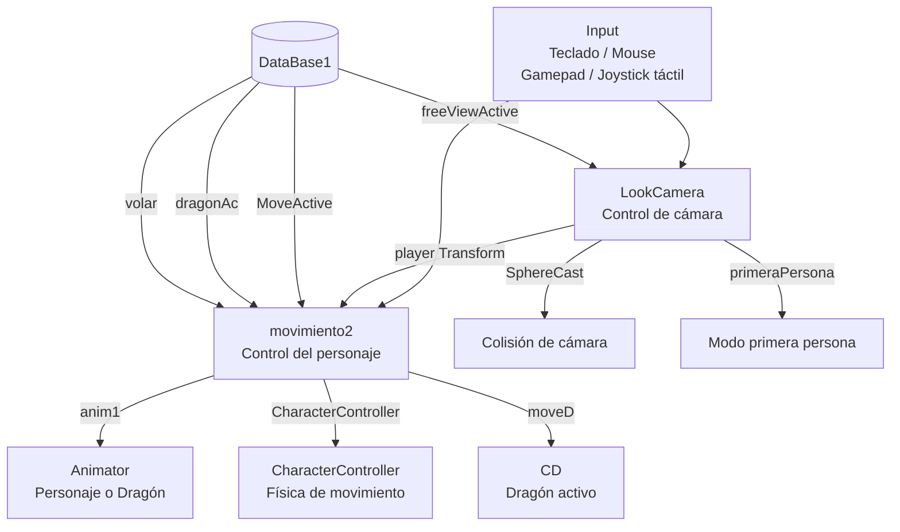
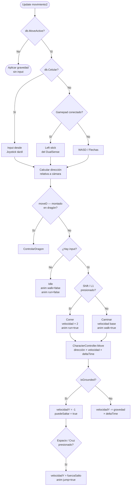
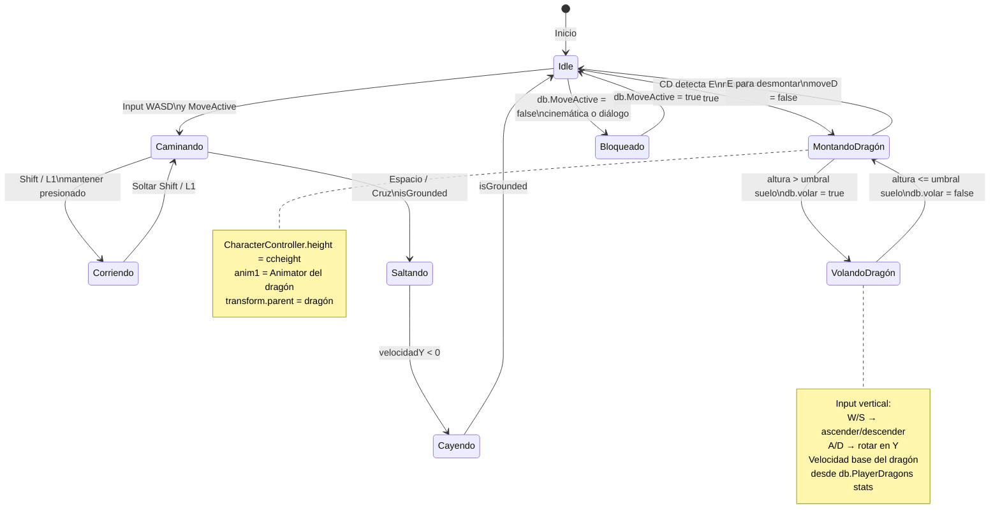
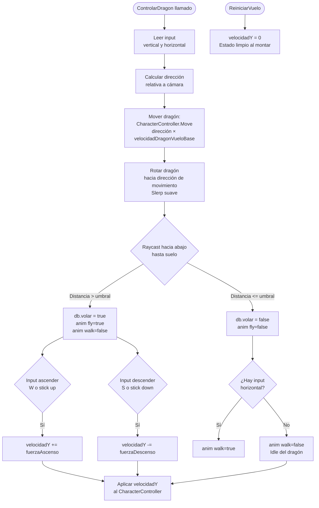
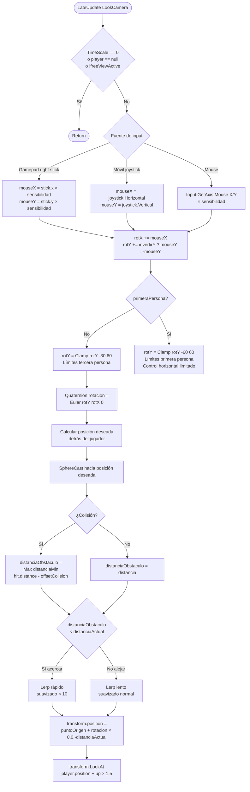
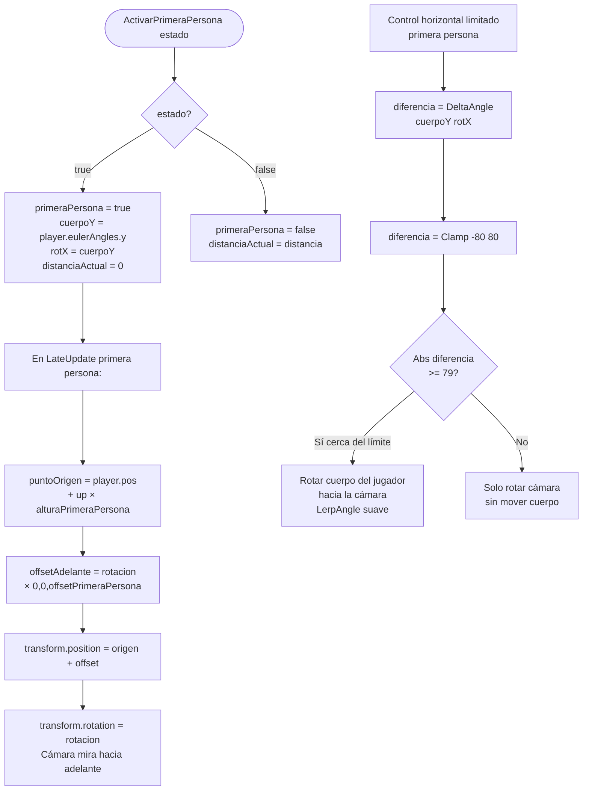
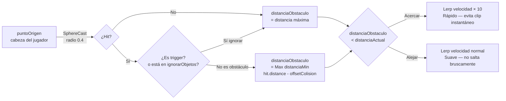
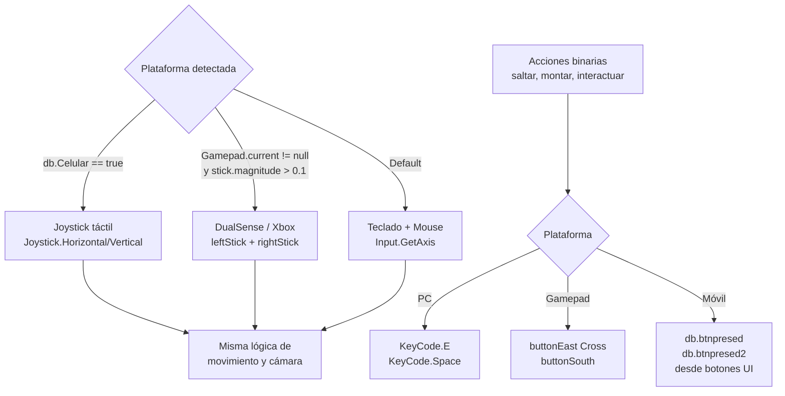

# 🎮 Sistema de Personaje y Cámara — Eteria World

> Documentación técnica del control del personaje, sistema de movimiento, vuelo en dragón y cámara en tercera/primera persona con colisión. Todos los sistemas soportan teclado, mouse, gamepad (DualSense) y controles táctiles móviles desde el mismo código.

**Scripts involucrados:** `movimiento2.cs` · `LookCamera.cs`

---

## Índice

1. [Arquitectura general](#1-arquitectura-general)
2. [Sistema de movimiento — movimiento2](#2-sistema-de-movimiento--movimiento2)
3. [Máquina de estados de movimiento](#3-máquina-de-estados-de-movimiento)
4. [Sistema de vuelo en dragón](#4-sistema-de-vuelo-en-dragón)
5. [Sistema de cámara — LookCamera](#5-sistema-de-cámara--lookcamera)
6. [Modo primera persona](#6-modo-primera-persona)
7. [Colisión de cámara](#7-colisión-de-cámara)
8. [Soporte multi-plataforma](#8-soporte-multi-plataforma)

---

## 1. Arquitectura general



---

## 2. Sistema de movimiento — movimiento2

`movimiento2` maneja todo el movimiento del personaje: caminar, correr, saltar, agacharse y volar en dragón. Un solo script cubre todos los estados posibles del jugador.



**Dirección relativa a cámara:**
El movimiento no es absoluto (eje Z del mundo) sino relativo a la orientación de la cámara. Si la cámara mira al norte, W mueve al norte. Si la cámara mira al este, W mueve al este.

```
forward = Vector3(cameraForward.x, 0, cameraForward.z).normalized
right   = Vector3(cameraRight.x, 0, cameraRight.z).normalized
dirección = forward × inputV + right × inputH
```

---

## 3. Máquina de estados de movimiento



---

## 4. Sistema de vuelo en dragón

Cuando el jugador monta un dragón, `movimiento2` toma control del dragón mediante la referencia `anim1` que apunta al `Animator` del dragón (asignada por `CMD`). El personaje del jugador pasa a ser pasajero.



**Velocidad del dragón desde stats:**
```csharp
m1.velocidadDragonVueloBase = db.PlayerDragons[dragonIndex].stat.velocidadMovimiento;
```
Cada dragón tiene su propia velocidad de vuelo calculada por `StatsUt.calculoVelocidadMovimiento`, que suma velocidad base + nivel + stat de velocidad. Un dragón de mayor nivel es notablemente más rápido.

**VFX de alas:**
Los efectos de partículas `flytrail` en las alas del dragón se activan solo durante el vuelo. Se buscan recursivamente en la jerarquía del dragón por nombre con `Utilidades.BuscarPorNombreRecursivo` al montar, y se activan/desactivan según `db.volar`.

---

## 5. Sistema de cámara — LookCamera

`LookCamera` implementa una cámara en tercera persona con rotación libre, límites verticales, suavizado de distancia y colisión física con el entorno.



---

## 6. Modo primera persona

La cámara tiene un modo primera persona usado al inicio del juego (jugador en cama) y al entrar en interiores. Cuando se activa, la distancia de cámara va a 0 y la cámara se posiciona justo delante de los ojos del personaje.



**Límites horizontales en primera persona:**
En tercera persona la cámara puede rotar 360° horizontalmente. En primera persona se limita a ±80° respecto a la orientación del cuerpo. Cuando el jugador llega cerca del límite, el cuerpo del personaje rota gradualmente para seguir la cámara, permitiendo girar más sin romper la ilusión de primera persona.

---

## 7. Colisión de cámara

La colisión evita que la cámara atraviese paredes o geometría. Usa `SphereCast` en lugar de `Raycast` para detectar obstáculos con un margen de radio, evitando que la cámara quede justo rozando la pared.



**`ignorarObjetos`:**
Array de Transforms que el SphereCast ignora. Al montar un dragón se añaden tanto el jugador como el dragón a esta lista, evitando que la cámara (ahora alejada 30 unidades) colisione con el propio cuerpo del dragón.

```csharp
// Al montar:
l1.ignorarObjetos = new Transform[] { player.transform.root, transform.root };
// Al desmontar:
l1.ignorarObjetos = new Transform[] { player.transform.root };
```

**Velocidad asimétrica de suavizado:**
Acercarse es instantáneo (×10) para evitar que la cámara atraviese paredes aunque sea un frame. Alejarse es suave para que la cámara no "salte" bruscamente al salir de un espacio estrecho.

---

## 8. Soporte multi-plataforma

Todo el sistema de input está encapsulado en condiciones que detectan la plataforma activa en runtime, sin compilaciones separadas.



**`db.btnpresed` — botones táctiles:**
En móvil no hay teclado, por lo que los botones de acción de la UI táctil escriben en flags de `DataBase1` (`btnpresed`, `btnpresed2`). Los scripts de gameplay leen estos flags junto con el input de teclado/gamepad en el mismo `if`, unificando la lógica sin duplicar código.

**Sensibilidad configurable:**
`LookCamera.sensibilidadX` y `sensibilidadY` son variables estáticas. `UIscript8` las modifica directamente desde los sliders de ajustes sin necesidad de referencias entre objetos:
```csharp
LookCamera.sensibilidadX = sensibilidades[0].value;
LookCamera.sensibilidadY = sensibilidades[1].value;
LookCamera.invertirY = ejeY.value;
```

---

> 📸 *Capturas sugeridas:*
> - `docs/assets/sistemas/tercera-persona.gif` — movimiento en tercera persona con colisión de cámara
> - `docs/assets/sistemas/primera-persona.gif` — transición a primera persona al entrar en interior
> - `docs/assets/sistemas/vuelo-dragon.gif` — control de vuelo con detección de altura
> - `docs/assets/sistemas/colision-camara.gif` — cámara esquivando paredes en espacio estrecho
